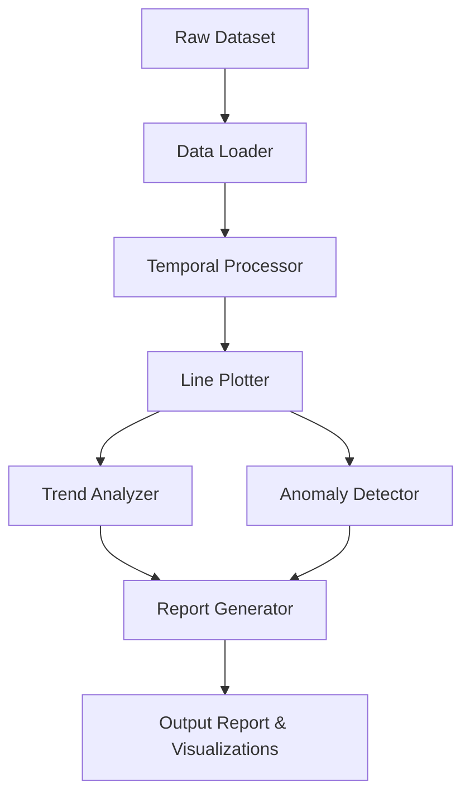

# Design Document: Time-Series Trend Visualization

## Overview

The Time-Series Trend Visualization milestone provides an educational framework for students to learn temporal data analysis and visualization. The system consists of Python modules for data loading, temporal processing, line plot creation, trend analysis, and anomaly detection. The implementation uses pandas for data manipulation and matplotlib/seaborn for visualization, with Jupyter notebook integration for interactive exploration.

This is an exploratory data analysis (EDA) tool focused on visualization and pattern recognition, not predictive modeling or forecasting. The design emphasizes educational clarity, best practices in data visualization, and hands-on learning through interactive examples.

## Architecture

The system follows a modular architecture with clear separation of concerns:

```
time_series_visualizer/
├── data/
│   ├── loader.py          # Data loading and validation
│   └── temporal.py        # Temporal data processing
├── visualization/
│   ├── plotter.py         # Line plot creation
│   └── styling.py         # Visual styling and formatting
├── analysis/
│   ├── trends.py          # Trend identification
│   └── anomalies.py       # Anomaly detection
├── reporting/
│   ├── generator.py       # Report generation
│   └── templates/         # Report templates
├── examples/
│   ├── notebooks/         # Jupyter notebooks
│   └── datasets/          # Sample datasets
└── docs/
    ├── quick_reference.md # Quick reference guide
    └── video_script.md    # Video walkthrough script
```

### Component Interaction Flow



## Components and Interfaces

### Data Loader Module

**Purpose:** Load datasets and identify temporal columns

**Interface:**
```python
class DataLoader:
    def load_dataset(filepath: str) -> pd.DataFrame
    def identify_temporal_columns(df: pd.DataFrame) -> List[str]
    def validate_dataset(df: pd.DataFrame) -> ValidationResult
```

**Responsibilities:**
- Load CSV, Excel, and other common data formats
- Automatically detect columns containing temporal data
- Validate data structure and completeness
- Handle file I/O errors gracefully

### Temporal Processor Module

**Purpose:** Parse, validate, and order temporal data

**Interface:**
```python
class TemporalProcessor:
    def parse_temporal_column(df: pd.DataFrame, column: str) -> pd.DataFrame
    def sort_by_time(df: pd.DataFrame, time_column: str) -> pd.DataFrame
    def detect_gaps(df: pd.DataFrame, time_column: str) -> List[Gap]
    def validate_temporal_data(series: pd.Series) -> bool
```

**Responsibilities:**
- Parse string dates into datetime objects
- Sort data chronologically
- Identify missing timestamps in regular intervals
- Validate temporal data integrity

### Line Plotter Module

**Purpose:** Create line plots with proper formatting

**Interface:**
```python
class LinePlotter:
    def create_line_plot(
        df: pd.DataFrame,
        time_column: str,
        value_columns: List[str],
        title: str = None,
        **kwargs
    ) -> Figure
    
    def format_time_axis(ax: Axes, time_range: pd.DatetimeIndex) -> None
    def add_labels_and_legend(ax: Axes, labels: Dict[str, str]) -> None
    def save_plot(fig: Figure, filepath: str, format: str = 'png') -> None
```

**Responsibilities:**
- Create matplotlib/seaborn line plots
- Format x-axis for temporal readability
- Apply consistent styling and colors
- Export plots in multiple formats

### Styling Module

**Purpose:** Apply visualization best practices

**Interface:**
```python
class PlotStyler:
    def get_colorblind_palette(n_colors: int) -> List[str]
    def apply_grid(ax: Axes) -> None
    def set_figure_size(width: float, height: float) -> Tuple[float, float]
    def get_line_styles(n_lines: int) -> List[str]
```

**Responsibilities:**
- Provide colorblind-friendly palettes
- Configure grid lines and spacing
- Set appropriate figure dimensions
- Manage line styles for multiple series

### Trend Analyzer Module

**Purpose:** Identify and quantify trends in time-series data

**Interface:**
```python
class TrendAnalyzer:
    def identify_trend(series: pd.Series) -> TrendResult
    def calculate_trend_magnitude(series: pd.Series) -> float
    def distinguish_noise_from_trend(series: pd.Series, window: int) -> pd.Series
    def describe_trend(trend_result: TrendResult) -> str
```

**Responsibilities:**
- Classify trends as upward, downward, or stable
- Calculate trend magnitude and direction
- Apply smoothing to distinguish signal from noise
- Generate human-readable trend descriptions

### Anomaly Detector Module

**Purpose:** Identify sudden changes and unusual patterns

**Interface:**
```python
class AnomalyDetector:
    def detect_spikes(series: pd.Series, threshold: float) -> List[Anomaly]
    def calculate_volatility(series: pd.Series, window: int) -> pd.Series
    def identify_sudden_changes(series: pd.Series) -> List[Change]
    def highlight_anomalies_on_plot(ax: Axes, anomalies: List[Anomaly]) -> None
```

**Responsibilities:**
- Detect statistical outliers and spikes
- Measure volatility over time windows
- Identify sudden changes in trend direction
- Annotate plots with anomaly markers

### Report Generator Module

**Purpose:** Create milestone completion reports

**Interface:**
```python
class ReportGenerator:
    def generate_report(
        analysis_results: AnalysisResults,
        plots: List[Figure],
        template: str = 'default'
    ) -> str
    
    def create_milestone_report(
        dataset_name: str,
        findings: Dict[str, Any]
    ) -> str
    
    def export_report(content: str, filepath: str, format: str = 'html') -> None
```

**Responsibilities:**
- Generate HTML/Markdown reports
- Include visualizations with captions
- Document trends and anomalies found
- Provide milestone completion template

## Data Models

### ValidationResult

```python
@dataclass
class ValidationResult:
    is_valid: bool
    errors: List[str]
    warnings: List[str]
    temporal_columns: List[str]
```

### Gap

```python
@dataclass
class Gap:
    start_time: datetime
    end_time: datetime
    expected_points: int
    missing_points: int
```

### TrendResult

```python
@dataclass
class TrendResult:
    direction: str  # 'upward', 'downward', 'stable'
    magnitude: float
    confidence: float
    start_value: float
    end_value: float
    description: str
```

### Anomaly

```python
@dataclass
class Anomaly:
    timestamp: datetime
    value: float
    anomaly_type: str  # 'spike', 'drop', 'volatility'
    severity: float
    description: str
```

### Change

```python
@dataclass
class Change:
    timestamp: datetime
    before_value: float
    after_value: float
    percent_change: float
    change_type: str  # 'increase', 'decrease'
```

### AnalysisResults

```python
@dataclass
class AnalysisResults:
    dataset_name: str
    time_column: str
    value_columns: List[str]
    trends: Dict[str, TrendResult]
    anomalies: Dict[str, List[Anomaly]]
    gaps: List[Gap]
    summary: str
```


## Correctness Properties

A property is a characteristic or behavior that should hold true across all valid executions of a system—essentially, a formal statement about what the system should do. Properties serve as the bridge between human-readable specifications and machine-verifiable correctness guarantees.

### Property 1: Temporal Column Identification

*For any* dataset with columns of various types, the system should correctly identify all columns containing temporal data (dates, timestamps, or time values) and exclude non-temporal columns from the identification list.

**Validates: Requirements 1.1**

### Property 2: Temporal Data Parsing Round Trip

*For any* valid datetime value, converting it to a string representation and then parsing it back should produce an equivalent datetime object.

**Validates: Requirements 1.3**

### Property 3: Invalid Temporal Data Error Handling

*For any* string that cannot be parsed as a valid datetime, the system should return a descriptive error message rather than crashing or producing incorrect results.

**Validates: Requirements 1.4**

### Property 4: Sorting Preserves All Data Points

*For any* dataset with temporal data, sorting by the temporal column should preserve all data points (including duplicates) while arranging them in chronological order.

**Validates: Requirements 2.1, 2.2**

### Property 5: Gap Detection in Regular Intervals

*For any* time series with regular intervals and known missing timestamps, the gap detection function should identify all gaps and report their locations and sizes accurately.

**Validates: Requirements 2.3**

### Property 6: Temporal Validation Rejects Null Values

*For any* dataset where the temporal column contains null or invalid values, the validation function should reject the dataset before plotting and return appropriate error messages.

**Validates: Requirements 2.4**

### Property 7: Valid Plot Creation with Required Elements

*For any* valid temporal column and numeric column, creating a line plot should produce a figure object with time on the x-axis, numeric values on the y-axis, axis labels, a title, and continuous lines.

**Validates: Requirements 3.1, 3.2, 3.4**

### Property 8: X-Axis Formatting for Large Ranges

*For any* time series spanning more than one year, the x-axis labels should be formatted with appropriate date intervals (not showing every single timestamp) to maintain readability.

**Validates: Requirements 3.3**

### Property 9: Multi-Series Plotting with Visual Distinction

*For any* dataset with multiple numeric columns, plotting all columns on the same axes should create distinct lines with different colors or line styles, making each series visually distinguishable.

**Validates: Requirements 3.5, 9.3**

### Property 10: Trend Analysis Output Format

*For any* time series with at least three data points, trend analysis should produce a result containing direction (upward/downward/stable), magnitude, and a descriptive summary.

**Validates: Requirements 4.1, 4.3**

### Property 11: Trend Detection with Noise

*For any* time series with an underlying linear trend plus random noise, the trend detection algorithm should identify the direction of the underlying trend correctly, not be misled by short-term fluctuations.

**Validates: Requirements 4.2**

### Property 12: Minimum Data Points for Trend Analysis

*For any* time series with fewer than three data points, the trend analysis function should decline to make a trend conclusion and return an appropriate message indicating insufficient data.

**Validates: Requirements 4.4**

### Property 13: Anomaly Detection Output Format

*For any* time series containing statistical outliers, the anomaly detection function should identify the anomalies and return results containing timestamps, values, anomaly types, and severity measures.

**Validates: Requirements 5.1, 5.2**

### Property 14: Volatility Calculation

*For any* time series, calculating volatility over a sliding window should produce a series of the same length (or appropriately shorter) with non-negative volatility measures.

**Validates: Requirements 5.3**

### Property 15: Time Range Filtering Preserves Order

*For any* time series and any valid time range, filtering the data to that range should return only data points within the range while preserving chronological order.

**Validates: Requirements 6.2**

### Property 16: Multi-Dataset Overlay

*For any* set of multiple time series datasets with compatible time ranges, the system should create a single plot with all datasets overlaid, each with distinct visual attributes.

**Validates: Requirements 6.3**

### Property 17: Complete Report Generation

*For any* analysis results containing trends and anomalies, the report generator should produce a report that includes both the analysis findings and embedded visualizations with descriptive captions.

**Validates: Requirements 8.1, 8.2**

### Property 18: Plot Export Format Support

*For any* valid plot figure, the system should successfully export it to PNG and SVG formats without data loss or corruption.

**Validates: Requirements 8.3**

### Property 19: Colorblind-Friendly Palette

*For any* plot requiring multiple colors, the system should use colors from a colorblind-friendly palette (such as ColorBrewer or Okabe-Ito) that provides adequate contrast and distinction.

**Validates: Requirements 9.1**

### Property 20: Adequate Figure Dimensions

*For any* plot created by the system, the figure dimensions should meet minimum readability requirements (at least 8x6 inches or 800x600 pixels) and use a DPI of at least 100.

**Validates: Requirements 9.2**

### Property 21: Grid Lines Presence

*For any* line plot created by the system, the plot should include grid lines on both axes to aid in reading values.

**Validates: Requirements 9.4**

## Error Handling

The system implements comprehensive error handling at multiple levels:

### Data Loading Errors

- **File Not Found**: Return clear error message with the attempted file path
- **Unsupported Format**: List supported formats and suggest alternatives
- **Corrupted Data**: Identify the problematic rows/columns and suggest data cleaning

### Temporal Processing Errors

- **Unparseable Dates**: Report the specific values that couldn't be parsed and suggest format strings
- **Mixed Date Formats**: Detect inconsistent formats and attempt automatic resolution or prompt user
- **Null Temporal Values**: Report count and location of null values, suggest imputation or removal

### Plotting Errors

- **Non-Numeric Values**: Identify non-numeric data in value columns and suggest conversion or filtering
- **Empty Dataset**: Prevent plotting and inform user that data is required
- **Mismatched Lengths**: Validate that time and value columns have the same length

### Analysis Errors

- **Insufficient Data**: Clearly communicate minimum data requirements for each analysis type
- **Invalid Parameters**: Validate all user-provided parameters (thresholds, windows) before processing
- **Numerical Instability**: Handle edge cases like zero variance or infinite values gracefully

### Error Recovery Strategies

- **Graceful Degradation**: If optional features fail, continue with core functionality
- **Informative Messages**: All errors include context, cause, and suggested remediation
- **Logging**: Record all errors with timestamps for debugging and learning purposes

## Testing Strategy

The testing strategy employs both unit tests and property-based tests to ensure comprehensive coverage and correctness.

### Property-Based Testing

Property-based testing will be implemented using **Hypothesis** for Python. Each correctness property listed above will be implemented as a property-based test that runs a minimum of 100 iterations with randomly generated inputs.

**Configuration:**
- Library: Hypothesis (Python)
- Minimum iterations: 100 per property test
- Each test tagged with: `# Feature: time-series-trend-visualization, Property N: [property text]`
- Generators for: dataframes, temporal data, numeric series, time ranges

**Property Test Coverage:**
- All 21 correctness properties will have corresponding property-based tests
- Tests will use Hypothesis strategies to generate diverse inputs
- Edge cases (empty data, single points, extreme values) will be included in generation strategies

### Unit Testing

Unit tests will focus on specific examples, integration points, and edge cases that complement property-based tests.

**Unit Test Focus Areas:**
- Specific date format parsing (ISO 8601, US format, European format)
- Known datasets with documented trends (e.g., increasing linear, seasonal)
- Integration between modules (loader → processor → plotter)
- Edge cases: single data point, all identical values, extreme outliers
- Error conditions: invalid file paths, corrupted data, type mismatches

**Test Organization:**
```
tests/
├── unit/
│   ├── test_data_loader.py
│   ├── test_temporal_processor.py
│   ├── test_line_plotter.py
│   ├── test_trend_analyzer.py
│   ├── test_anomaly_detector.py
│   └── test_report_generator.py
├── property/
│   ├── test_properties_data.py
│   ├── test_properties_plotting.py
│   ├── test_properties_analysis.py
│   └── test_properties_reporting.py
├── integration/
│   └── test_end_to_end.py
└── fixtures/
    └── sample_datasets/
```

### Testing Balance

- Property-based tests handle comprehensive input coverage (100+ cases per property)
- Unit tests validate specific known examples and integration points (~50 tests)
- Integration tests verify end-to-end workflows (~10 tests)
- Total expected test count: ~200 property test cases + ~60 unit/integration tests

### Continuous Validation

- All tests run on every commit via CI/CD
- Property tests catch regression in general behavior
- Unit tests catch regression in specific examples
- Coverage target: 90% code coverage, 100% property coverage
